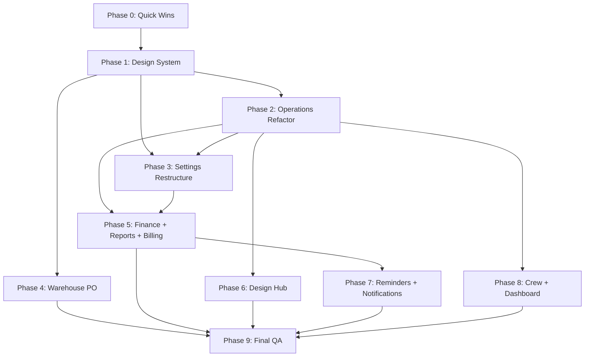

# REFINEMENT ROADMAP — Tetra Ops

**Audit date**: 2026-05-19
**Status**: **Proposal** — 15-week sequenced plan synthesizing AUDIT_UI_UX, AUDIT_PERFORMANCE, DESIGN_SYSTEM findings into actionable implementation roadmap.

---

## 0. Strategic Context

**Pivot from "feature velocity" to "polish + refine"**:
- ❌ NOT building: new modules, new features, framework switches
- ✅ ARE doing: design system enforcement, IA restructure, multi-owner foundation, performance hardening

**Owner-stated priorities** (from session brief):
1. UI inconsistency antar module
2. Information hierarchy berantakan
3. Navigation flow gak logical
4. Action discoverability poor
5. Consistency antar module rendah
6. **Speed lambat, loading data lama**

**Audit-validated severity**:
- P0 (must fix): 10 critical issues (see AUDIT_UI_UX.md §4)
- P1 (major refinement): ~25 issues across modules
- P2 (polish): ~40 minor issues
- Performance: 3 confirmed N+1 + 7 quick wins worth ~4-5h effort

**Investment expectation**: ~15 weeks (3.5 months) focused engineer time untuk complete roadmap. Quick wins (Phase 0) alone deliver visible improvement within 1-2 days.

---

## 1. Module Priority Ranking

Scored 0-10 per dimension (per AUDIT_UI_UX module scorecard):

| # | Module | Business Impact | Current State | User Pain | Effort | Dependencies | Priority |
|---|--------|-----------------|---------------|-----------|--------|--------------|----------|
| 1 | **Operations** | 10 | 6.9 | 9 (briefing flow, settlement confusion) | L (3-4 wk) | Design system, multi-owner | **P0** |
| 2 | **Settings** | 7 | 5.9 | 10 (owner direct quote "paling overwhelming") | M-L (2 wk) | Design system | **P0** |
| 3 | **Finance** | 9 | 7.3 | 9 (4 missing P0 features) | L (3 wk) | Reports merge | **P0** |
| 4 | **Warehouse** | 6 | 6.5 | 7 (PO module missing) | M-L (2 wk) | None | **P0** |
| 5 | **Reports** | 7 | 6.7 | 8 (no financial statements, overlap) | M-L (2 wk) | Finance | **P0** |
| 6 | **Design Hub** | 5 | 7.0 | 5 (workflow split) | M (1 wk) | Operations | **P1** |
| 7 | **Notifications** | 5 | 7.3 | 4 (DB bloat risk) | S-M (3 days) | None | **P1** |
| 8 | **Crew Owner-side** | 6 | 7.5 | 6 (mobile broken) | M (1 wk) | Design system | **P1** |
| 9 | **Billing** | 6 | 7.5 | 5 (PDF brand, payment split) | M (1 wk) | None | **P2** |
| 10 | **Dashboard** | 7 | 8.3 | 3 (polish) | S (2 days) | Multi-owner | **P2** |
| 11 | **Reminders** | 4 | 8.5 | 2 (strongest module) | S (1 day) | None | **P3** |
| 11b | **Crew Mobile** | 7 | 8.4 | 3 (Prompt 4 polished) | S (1 day) | None | **P3** |

**Calculation note**: Priority = Business Impact × User Pain ÷ Effort (logarithmic scale).

---

## 2. Phased Implementation Plan (15 weeks)

### PHASE 0: Quick Wins (Week 0 — concurrent prep, ~1-2 days total)

**Goal**: Visible improvement immediately, low risk.

**Deliverables**:
- [ ] **Q1**: Remove Playfair Display font (`src/app/layout.tsx:14-18`) — 5min, -50KB CDN
- [ ] **Q2**: Remove `@tanstack/react-query` + `zustand` from package.json — 5min, -~35KB potential
- [ ] **Q3**: Pass `user` prop to AnomalyRadarWidget (kill double getCurrentUser on Dashboard) — 30min, -150-300ms TTI
- [ ] **Q4**: Add `redirect("/operations/[id]/rekap")` di /settle + /tutup-buku — 30min, kills route confusion
- [ ] **Q5**: Remove `hover:-translate-y-px` from Dashboard event card (line 408) — 5min
- [ ] **Q6**: Fix "crimson accent" stale comment di Dashboard (line 244) — 2min
- [ ] **Q7**: Consolidate KpiCard — remove local def in Reports (lines 1133-1172), import shared — 15min
- [ ] **Q8**: Add SOURCE_LABELS['rekap_consumption'] in warehouse-tables.tsx — 5min
- [ ] **Q9**: Add `aria-current="page"` to active OperationsViewSwitcher tab — 10min
- [ ] **Q10**: Add `expires_at` filter to notifications query — 15min
- [ ] **Q11**: Replace "Outstanding balance" → "Sisa Pembayaran" di Reminders — 5min

**Effort total**: ~3-4 hours
**Impact**: visible cleanup across 7 modules, -200KB+ bundle, faster dashboard

**Success criteria**: All 11 fixes merged + Vercel auto-deploy successful.

---

### PHASE 1: Foundation — Design System Enforcement (Week 1-2)

**Goal**: Eliminate 80% of consistency issues at the source — fix primitives, kill drift.

**Deliverables**:

#### W1: Token Primitives Update
- [ ] **F1.1**: Update `Card` primitive ([src/components/ui/card.tsx:15](src/components/ui/card.tsx#L15)) — `rounded-xl ring-1` → `rounded-lg border border-border-default`
  - Cascades into ~50+ caller files; visual diff QA on Dashboard, Operations, Finance
- [ ] **F1.2**: Update `EmptyState` primitive — `rounded-xl` → `rounded-lg`
- [ ] **F1.3**: Audit + fix `rounded-2xl` callers (Dashboard event card line 408, quick-actions line 464, others)
- [ ] **F1.4**: Audit + replace `shadow-lg`, `shadow-xl`, `shadow-2xl` callers with `shadow-level-*` tokens (16 occurrences)
- [ ] **F1.5**: Build out `<MoneyAmount>` primitive (enforce .tabular automatically), document migration path

#### W2: Color Violation Fixes
- [ ] **F1.6**: Design Hub badge palette — replace violet/amber/sky/emerald (lines 35-53) with ink + icon hierarchy
- [ ] **F1.7**: Mirror fix di [src/components/event-assets/asset-section.tsx:42-62](src/components/event-assets/asset-section.tsx#L42)
- [ ] **F1.8**: Design card approve button — replace hardcoded `bg-emerald-600` with `<Button variant="decisive-success">`
- [ ] **F1.9**: Operations list table + Contacts list table + Booking assign-crew form — audit + fix decorative colors
- [ ] **F1.10**: Settings Backdrop badge custom tones (sky-500, amber-500) → semantic variants
- [ ] **F1.11**: Decide on PDF brand color — keep rose `#be123c` OR migrate to ink. Document decision.
- [ ] **F1.12**: Add Biome custom lint rules (or `scripts/check-design-tokens.ts`) untuk:
  - `rounded-2xl` outside marketing paths
  - Decorative colors (violet/teal/indigo etc.)
  - Inline eyebrow patterns
  - Hover translate violations
  - Tailwind default shadows

**Effort**: 7-10 days (2 weeks)
**Risk**: Visual regression on un-tested pages. **Mitigation**: Manual QA pass on each major page post-merge; consider Storybook/Chromatic setup at end of W2.
**Success**: `rounded-xl` usage drops from 174 → <50 (only intentional cases); 5 decorative color files cleaned; lint rules block future regressions.

---

### PHASE 2: Operations Module Refactor (Week 3-5)

**Goal**: Resolve highest-impact module (command center promise).

#### W3: Settlement Route Consolidation + Detail Page Split

- [ ] **F2.1**: Add explicit `redirect()` from /operations/[id]/settle + /tutup-buku → /rekap (already done in Phase 0; verify + delete legacy files after 2 weeks observation)
- [ ] **F2.2**: Migrate any remaining `settlements.ts` callers to `settle-event.ts` (unified RPC wrapper)
- [ ] **F2.3**: Split Operations detail page (`src/app/(owner)/operations/[projectId]/page.tsx`, 983 LOC) into:
  - `<EventReadinessSection>` (existing, verify)
  - `<EventFinancialCard>` (extract lines 616-681)
  - `<EventCrewCard>` (extract lines 684-755)
  - `<EventAddonCard>` (extract lines 757-789)
  - `<EventBonusCard>` (extract lines 792-831)
  - `<EventNotesCard>` (extract lines 834-844)
- [ ] **F2.4**: Detail page becomes ~200 LOC layout wrapper composing sub-components

#### W4: Briefing UX + List Improvements

- [ ] **F2.5**: Expand `<ProjectHeroRecap>` to include briefing checklist:
  - ✓ Crew assigned (count + roles) — currently buried
  - ✓ Backdrop + frame size — currently only in Financial card
  - ✓ Add-on count — currently collapsed
  - ✓ Design status badge — currently only in Activity feed
- [ ] **F2.6**: Standardize collapsible card defaults (Crew + Financial = `defaultOpen={true}` on detail page)
- [ ] **F2.7**: Operations list — expand search ke multi-column (venue, package, backdrop names)
- [ ] **F2.8**: Operations list — add bulk action UI (multi-select rows + bulk status change)
- [ ] **F2.9**: Operations list — encapsulate crew aggregation into `<OperationsListTable>` component (remove pre-computed prop)

#### W5: Multi-Owner Foundation (Foundation for Phase 3)

- [ ] **F2.10**: Migration — add `updated_at` + `updated_by_user_id` to events, crew_assignments, crew_rekap, crew_fee
- [ ] **F2.11**: Operations detail page — show "Last edited by [Name] X min ago" footer
- [ ] **F2.12**: Build `<RealtimeSync>` client wrapper subscribing to Supabase realtime on events + crew_assignments
- [ ] **F2.13**: Build `<PresenceIndicator>` (AvatarStack in topbar showing 2-4 online owners)
- [ ] **F2.14**: Optimistic conflict warning banner when concurrent edit detected

**Effort**: 3 weeks
**Risk**: Touch many files, regression risk high. **Mitigation**: Branch per-phase, smoke test each settlement flow before merge.
**Success**: Operations detail page <300 LOC; multi-owner real-time visible; briefing context above-fold; settlement routes consolidated.

---

### PHASE 3: Settings Restructure (Week 6)

**Goal**: 12 flat tabs → 5 grouped domains, system_config searchable, gaps closed.

- [ ] **F3.1**: Migrate route structure (parallel to existing — don't break URLs initially):
  - `/settings/products` (group: Packages, Add-ons, Backdrops, Items + Mapping + Import)
  - `/settings/people` (group: Crew + Invitations + Investor Share, Contacts)
  - `/settings/finance` (group: Bank Accounts, Sinking Funds)
  - `/settings/communications` (group: WhatsApp Templates, Notification Rules)
  - `/settings/system` (group: Configuration 33-keys, Audit Log)
- [ ] **F3.2**: Each domain page lists sub-tabs as cards or secondary nav
- [ ] **F3.3**: Old URLs redirect to new (`/settings/packages` → `/settings/products/packages`)
- [ ] **F3.4**: Add search input to system_config — filter 33 keys client-side by key+description
- [ ] **F3.5**: Implement Bank Account create/edit drawer (P0 gap fix)
- [ ] **F3.6**: Implement Contact create button + form (P0 gap fix)
- [ ] **F3.7**: Complete Frame Size Mapping form (grid: REKAP_FIELDS × frame_sizes → SKU select) (P0 gap fix)
- [ ] **F3.8**: Add edit drawer for Notification Rules (P1 gap)
- [ ] **F3.9**: Add pre-apply confirmation modal for critical system_config keys (`settlement.require_approved_rekap`, etc.)
- [ ] **F3.10**: Crew page — collapse invitations by default, move investor share to expandable section

**Effort**: 1-2 weeks
**Risk**: URL rewiring affects bookmarks/external links. **Mitigation**: Maintain old URL redirects indefinitely.
**Success**: Settings IA cognitive load 7/10 → 3/10; system_config searchable; 3 P0 gaps closed.

---

### PHASE 4: Warehouse + Inventory (Week 7-8)

**Goal**: Address owner's "belanja item belum jelas" concern.

#### W7: Purchase Order Module (Lightweight)

- [ ] **F4.1**: Schema — add `purchase_orders` table (po_number, supplier, date, total, status: draft/confirmed/received) + `po_lines` (item_id, qty_ordered, qty_received, unit_price)
- [ ] **F4.2**: Schema — add `suppliers` table (name, contact, payment_terms)
- [ ] **F4.3**: Build `/warehouse/purchases` list page + `/warehouse/purchases/new` PO creation flow
- [ ] **F4.4**: Receiving workflow — mark items received, auto-create stock_movements with source='purchase' + source_id=po_id
- [ ] **F4.5**: PO history per item — drill from item detail to "show all purchases past 90 days"

#### W8: Stock Management Polish

- [ ] **F4.6**: Negative stock prevention in manual adjust — UI warning when qty > current; require confirmation
- [ ] **F4.7**: Force `unit_cost` field when direction=in + source=purchase (weighted-avg drift fix)
- [ ] **F4.8**: Add reorder suggestion UI — show items where current_stock ≤ min_stock_alert with "Generate PO draft" button
- [ ] **F4.9**: Source labels — fix SOURCE_LABELS['rekap_consumption'] (done Phase 0) + link source_id to event detail in movements log
- [ ] **F4.10**: Equipment tracking — decide model (qty-tracked vs serial-tracked); implement equipment_units table if serial; add stock_movements support if qty
- [ ] **F4.11**: Performance — implement `get_current_stock_batch` RPC (see AUDIT_PERFORMANCE.md §B.1.1)

**Effort**: 2 weeks
**Risk**: New schema introduces complexity. **Mitigation**: Phase deployment — PO module behind feature flag initially.
**Success**: Owner can record purchases properly; reorder suggestions visible; N+1 stock query eliminated.

---

### PHASE 5: Finance + Reports + Billing (Week 9-11)

**Goal**: Close 4 Finance P0 gaps + merge Reports overlap + Billing polish.

#### W9: Merge Reports into Finance

- [ ] **F5.1**: Create `/src/lib/data/financial-queries.ts` — single source of truth for monthly P&L, settlement aggregates, sinking balances
- [ ] **F5.2**: Refactor `/finance` page to consume from `financial-queries.ts`
- [ ] **F5.3**: Move Reports content under `/finance?view=reports` OR keep `/reports` but consume same queries — eliminate duplicate fetching
- [ ] **F5.4**: Add period selector UI (month/quarter/year/custom range) to `/finance`
- [ ] **F5.5**: Add period comparison (vs prev month, YoY) toggle
- [ ] **F5.6**: Split Reports mega-file (1180 LOC) into per-tab components (PnlSection, CrewSection, OwnerSection)

#### W10: Finance P0 Gaps

- [ ] **F5.7**: Build `/finance/expenses` (manual OpEx entry) — form: date, amount, account_code, description, attachment. New `opex_entries` table.
- [ ] **F5.8**: Build `/finance/journal` browser — fetch journal_entries with filters (date range, entry_type, source_type); expandable rows showing journal_lines (account code, Dr, Cr); link back to source event
- [ ] **F5.9**: Build `/settings/chart-of-accounts` CRUD — add/edit/deactivate accounts; enforce code pattern; guard against type-change after journal lines exist
- [ ] **F5.10**: Build `/finance/reconciliation` per bank account — list pending payments, allow manual mark-as-cleared, highlight discrepancies

#### W11: Billing Polish + Export

- [ ] **F5.11**: Add PdfDownloadMenu to billing list table — quick PDF generate without navigating to event detail
- [ ] **F5.12**: Centralize billing terminology — create `src/lib/billing-terms.ts` with DOCUMENT_TYPE_LABELS (en+id)
- [ ] **F5.13**: Fix unpaid badge variant — change from `outline` to `warning`
- [ ] **F5.14**: Add payment logging modal to billing list — log payment without leaving page
- [ ] **F5.15**: Implement PDF preview (iframe) — view before send
- [ ] **F5.16**: Add CSV export for journal entries, settlement history, vendor commissions
- [ ] **F5.17**: Performance — batch sinking_fund_balance via `get_sinking_fund_balance_batch` RPC OR SQL view

**Effort**: 3 weeks
**Risk**: Major architectural change (Reports + Finance merge). **Mitigation**: Both routes active during transition; deprecate after 2 weeks observation.
**Success**: 4 Finance P0 gaps closed; financial statements possible (foundation for Balance Sheet/Cash Flow later); period comparison in Reports; reduced data fetching duplication.

---

### PHASE 6: Design Hub Consolidation (Week 12)

**Goal**: Decide ownership Operations vs Design Hub; fix UX richness.

- [ ] **F6.1**: Decide ownership — recommendation: `/design/*` owns asset CRUD + brief approval workflow; `/operations/[id]` shows read-only asset summary linked to /design
- [ ] **F6.2**: Migrate DesignCard from `/operations/[id]` to read-only summary; primary approval flow at `/design/[id]`
- [ ] **F6.3**: Add image thumbnails — detect Drive URL via API → thumbnail; lazy-loaded; fallback to type icon
- [ ] **F6.4**: Add URL preview validation — client-side og:meta check on blur + server-side HEAD request on save
- [ ] **F6.5**: Add drag-drop file upload zone — integrate with `/api/drive/upload/[projectId]`
- [ ] **F6.6**: Upgrade empty state — centered card with icon + title + description + action button (per design system pattern)
- [ ] **F6.7**: Standardize asset section across views (gallery vs list toggle)

**Effort**: 1 week
**Success**: Design Hub workflow clear; visual asset richness improved; no duplicate effort with Operations.

---

### PHASE 7: Reminders + Notifications (Week 13)

**Goal**: Polish strongest modules + close DB design flaw.

- [ ] **F7.1**: Notifications — add `expires_at` filter to query (done Phase 0; verify rolled out)
- [ ] **F7.2**: Notifications — verify mark-read revalidatePath behavior; add realtime subscription on `notifications` table for instant unread count updates
- [ ] **F7.3**: Notifications — implement similar-notification batching (group by anomaly_rule_id + hour bucket); show "X similar alerts collapsed"
- [ ] **F7.4**: Notifications — service worker error handling + push test error detail logging (VAPID 410 expired vs auth mismatch)
- [ ] **F7.5**: Reminders — add batch send confirmation dialog for >5 items
- [ ] **F7.6**: Reminders — add responsive height limit to template preview modal (mobile overflow fix)
- [ ] **F7.7**: Reminders — add re-send cooldown (1h minimum between sends per event)
- [ ] **F7.8**: Reminders — link sent reminders to Notifications inbox for audit trail
- [ ] **F7.9**: Centralize `timeAgo()` utility — kill `relativeTime()` duplicate

**Effort**: 1 week
**Success**: Notifications DB bloat prevented; cross-portal audit trail; centralized utilities.

---

### PHASE 8: Crew Owner-Side Mobile + Dashboard Polish (Week 14)

**Goal**: Close mobile gaps + polish strong modules.

#### Crew Owner-Side

- [ ] **F8.1**: Settings Crew page — implement responsive card layout for <768px (table broken on mobile currently)
- [ ] **F8.2**: Operations Team Gantt — implement vertical timeline view on mobile (<400px); list view toggle
- [ ] **F8.3**: AssignCrewForm — add conflict tooltip explaining "which event, what role" on red-flagged crew
- [ ] **F8.4**: Fee calculation — show breakdown box ("Tier: Senior · Base: Rp 2M · Bonus: Rp 200K = Rp 2.2M") on assignment page
- [ ] **F8.5**: Add tier field to EditCrewDrawer
- [ ] **F8.6**: Add file upload progress to RekapForm (image-compression + Drive upload)

#### Dashboard Polish

- [ ] **F8.7**: Dashboard — add real-time multi-owner sync via foundation built in Phase 2 (RealtimeSync wrapper)
- [ ] **F8.8**: Dashboard — add target+anomaly skeletons to loading.tsx (fix CLS)
- [ ] **F8.9**: Dashboard — clarify StatCard interactivity (decide link vs static, add focus ring)
- [ ] **F8.10**: Dashboard — verify Container max-width enforcement on 4K monitors

**Effort**: 1 week
**Success**: Owner can manage crew on mobile; Dashboard delivers real-time multi-owner promise.

---

### PHASE 9: Final QA + Documentation (Week 15)

**Goal**: Validate refinement work, document new patterns, prep for next chapter.

- [ ] **F9.1**: Cross-module visual QA — Storybook snapshots OR Chromatic visual diff CI
- [ ] **F9.2**: Performance benchmarking — run Lighthouse mobile (Slow 4G) on top 10 routes; verify TTI <2s
- [ ] **F9.3**: Accessibility audit — automated (axe-core or Lighthouse) + manual screen reader pass on Operations + Settings + Rekap form
- [ ] **F9.4**: Update DESIGN.md with any token changes
- [ ] **F9.5**: Update HANDOVER.md with new patterns + deprecated routes
- [ ] **F9.6**: Update README with onboarding checklist
- [ ] **F9.7**: Storybook setup — add stories for top 20 components + 5 patterns

**Effort**: 1 week
**Success**: Documentation up-to-date; visual regression CI in place; performance budget met; a11y AA confirmed.

---

## 3. Risk Assessment per Phase

| Phase | Risk | Severity | Mitigation |
|-------|------|----------|------------|
| 0 | Quick win breaks something | Low | Each fix isolated; revert if issue |
| 1 | Card primitive change visual regression | Medium | Manual QA per major page; consider Chromatic post-W1 |
| 2 | Operations refactor breaks settlement flow | **High** | Branch per task; smoke test via `verify-rekap.ts` after each step |
| 3 | Settings URL rewiring breaks bookmarks | Medium | Maintain old URL redirects indefinitely |
| 4 | PO schema migration breaks existing stock_movements | Medium | PO module behind feature flag; backfill existing manual purchases optionally |
| 5 | Reports/Finance merge breaks dashboards | **High** | Run both routes during transition; deprecate /reports only after 2 weeks |
| 6 | Design Hub flow change confuses owners | Low | Document workflow change in HANDOVER; show migration banner |
| 7 | Reminders cooldown blocks legitimate re-send | Low | Make threshold configurable in system_config |
| 8 | Realtime subscriptions cause Supabase quota issues | Medium | Monitor realtime channel usage; pagination by date range |
| 9 | Tests/Storybook don't catch real regressions | Medium | Combine automated + manual QA; user testing with owner |

---

## 4. Success Criteria per Module

### Module: Operations (post-Phase 2)
- ✓ Detail page <300 LOC
- ✓ Briefing checklist visible above-fold (crew, package, backdrop, design, frame size)
- ✓ 3 settlement routes consolidated to 1
- ✓ Multi-owner realtime sync visible (presence indicator + last-edit attribution)
- ✓ Bulk action capability on list view
- ✓ Search covers multi-column

### Module: Settings (post-Phase 3)
- ✓ 12 tabs grouped into 5 domains
- ✓ system_config searchable
- ✓ Bank Accounts CRUD complete
- ✓ Contacts create form available
- ✓ Frame Size Mapping form working
- ✓ Pre-apply confirmation for critical config keys

### Module: Finance (post-Phase 5)
- ✓ Manual OpEx entry form available
- ✓ Journal entry browser with drill-down
- ✓ Chart of accounts CRUD
- ✓ Bank reconciliation per account
- ✓ Period comparison (vs prev month, YoY)
- ✓ Reports content consolidated (no duplication)

### Module: Warehouse (post-Phase 4)
- ✓ PO module functional (create → receive → auto-movement)
- ✓ Reorder suggestion UI
- ✓ Negative stock prevention (manual adjust validates)
- ✓ Source labels meaningful in movements log
- ✓ Performance: stock RPC batched (no N+1)

### Module: Design Hub (post-Phase 6)
- ✓ Asset thumbnails visible
- ✓ URL preview validation
- ✓ Drag-drop upload zone
- ✓ Workflow ownership clear (vs Operations)
- ✓ Color palette violations removed

### Modules: Reminders + Notifications (post-Phase 7)
- ✓ Notifications batched by rule
- ✓ Expired notifications hidden
- ✓ Mark-read instant via realtime
- ✓ Reminders linked to Notifications audit trail
- ✓ Reminders cooldown active

### Module: Crew (post-Phase 8)
- ✓ Owner mobile-responsive (Settings Crew table, Team view)
- ✓ Fee breakdown visible on assignment
- ✓ File upload progress on Rekap form
- ✓ Conflict tooltips explain "why"

### Module: Dashboard (post-Phase 8)
- ✓ Multi-owner realtime
- ✓ Target+anomaly skeletons
- ✓ StatCard interactivity clear
- ✓ Hover violations removed

### Module: Billing (post-Phase 5)
- ✓ PDF quick action in list
- ✓ Unpaid badge tone fixed
- ✓ Centralized terminology
- ✓ Payment logging modal

---

## 5. Manual Testing Checklist Template

For each phase, owner runs:

```
[ ] Login as super_admin → verify route access
[ ] Login as owner → verify scoped access
[ ] Login as crew → verify mobile portal functions
[ ] Smoke test:
    [ ] Booking creation: /operations/new → submit → event appears in list
    [ ] Crew assignment: /operations/[id]/crew → assign 3 crew → fees calculated correctly
    [ ] Crew rekap submit: /crew/jadwal/[id]/rekap → submit with 3 photos → success page
    [ ] Settlement: /operations/[id]/rekap → review rekap → settle → journal balanced
    [ ] Payment recording: /operations/[id]/payments → record payment → status updates
[ ] Cross-browser:
    [ ] Desktop Chrome (latest)
    [ ] Safari (latest)
    [ ] Mobile Chrome Android
    [ ] Mobile Safari iOS (incl. private browsing)
[ ] Network conditions:
    [ ] Cellular (Slow 4G via DevTools)
    [ ] Offline (verify graceful degradation)
[ ] Realtime (Phase 2+):
    [ ] Open 2 browser windows, edit same event → verify conflict warning
    [ ] Crew submits rekap → owner sees "Perlu review" notification without manual refresh
```

---

## 6. Dependency Graph



**Critical path**: Phase 0 → Phase 1 → Phase 2 → Phase 5 → Phase 9 (Operations + Finance are highest-impact, must complete before final QA).

**Parallelization opportunity**:
- After Phase 2 completes, Phase 3 (Settings) + Phase 4 (Warehouse) can run in parallel if 2 devs available
- After Phase 5 completes, Phase 6/7/8 can run in parallel (3 lanes)

---

## 7. Investment Summary

| Phase | Weeks | Effort (engineer-days) | Risk |
|-------|-------|------------------------|------|
| 0 | 0 (concurrent) | 0.5 | Low |
| 1 | 1-2 | 7-10 | Medium |
| 2 | 3-5 | 15 | **High** |
| 3 | 6 | 5-7 | Medium |
| 4 | 7-8 | 8-10 | Medium |
| 5 | 9-11 | 12-15 | **High** |
| 6 | 12 | 5 | Low |
| 7 | 13 | 5 | Low |
| 8 | 14 | 5 | Low |
| 9 | 15 | 5 | Medium |
| **Total** | **15** | **~70-80 days** | — |

**Equivalent**: 14-16 weeks of 1 focused engineer, OR 7-8 weeks with 2 engineers parallel after Phase 2.

**Cost-benefit**:
- ~14-16 weeks @ Indonesia dev rate = ~Rp 80-150M investment (varies by seniority)
- Vs alternative: continue feature velocity → exponential tech debt + owner UX dissatisfaction

---

## 8. Expected Outcomes

Post-completion (Week 15+):

**For Owner (Business)**:
- Multi-owner command center functional (4 owner monitor bareng with realtime sync)
- Settlement flow consolidated (1 route, not 3)
- Settings searchable & grouped (cognitive load 7/10 → 3/10)
- Finance journal browser + OpEx + CoA management = financial statements possible
- Warehouse PO module functional = "belanja jelas"
- Performance: Dashboard ~250ms faster, Rekap form ~800ms faster

**For Crew (Field Workers)**:
- Mobile portal already strong, polish maintained
- File upload progress visible (no anxiety on slow connections)
- Realtime sync after submit (no manual refresh)

**For Developers (Future Work)**:
- Design system non-negotiable (lint-enforced)
- Component library + patterns documented
- Codebase shrinks ~20% LOC (consolidated mega-files, removed dead deps)
- Storybook scaffolding ready for new feature work

**For Product (Strategic)**:
- Tetra Ops mature foundation for next chapter:
  - Multi-tenant (if franchise expansion)
  - Recurring events / templates
  - Advanced financial reports (Balance Sheet, Cash Flow Statement)
  - Equipment depreciation
  - Inventory restock workflow

---

**End of REFINEMENT_ROADMAP.md** — see companion docs:
- [AUDIT_UI_UX.md](AUDIT_UI_UX.md) — module audits + cross-cutting findings
- [AUDIT_PERFORMANCE.md](AUDIT_PERFORMANCE.md) — speed bottlenecks
- [DESIGN_SYSTEM.md](DESIGN_SYSTEM.md) — tokens spec + component library
- [AUDIT_SUMMARY.md](AUDIT_SUMMARY.md) — executive summary
